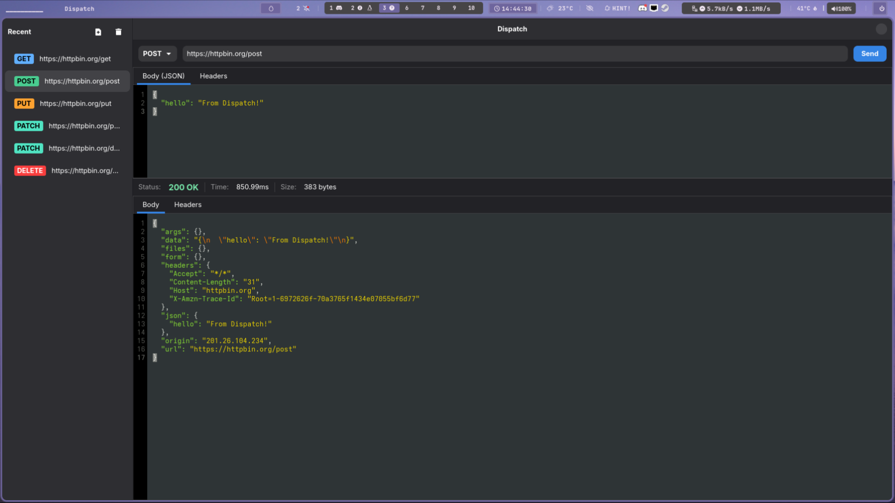

<div align="center">
  <h1>🚀 Dispatch</h1>
  
  <p>
    <strong>A lightweight, native HTTP client for Linux</strong>
  </p>
  
  <p>
    Built with Rust and GTK4 for a fast, resource-efficient API testing experience
  </p>
  
  <a href="#installation">
    
  </a>
  <a href="#installation">
    
  </a>
  <a href="#installation">
    
  </a>
  <a href="#installation">
    
  </a>
</div>

## 📸 Screenshot

<p align="center">
  
</p>

---

## ✨ Features

## Features

- ⚡ **Lightweight and Fast:** Built with Rust, Dispatch is designed to be fast and consume minimal system resources
- 🐧 **Native Linux Experience:** Uses GTK4 and Libadwaita to provide a modern, native look and feel on the Linux desktop
- 🌐 **HTTP Requests:** Send and manage HTTP requests with a simple and intuitive interface
- 🎨 **JSON Syntax Highlighting:** The response view uses Sourceview5 for JSON syntax highlighting
- 💾 **Local History:** Requests are stored locally in a SQLite database
- 🔧 **Developer-Friendly:** Clean, intuitive interface optimized for developers

## 📦 Installation

### 📋 Prerequisites

- **Rust** (latest stable version)
- **GTK4** development libraries
- **Libadwaita** development libraries  
- **Sourceview5** development libraries

#### 🐧 Ubuntu/Debian
```bash
sudo apt update
sudo apt install rustc cargo libgtk-4-dev libadwaita-1-dev libsourceview-5-dev
```

#### 🎩 Fedora
```bash
sudo dnf install rust cargo gtk4-devel libadwaita-devel sourceview5-devel
```

#### 🏛️ Arch Linux
```bash
sudo pacman -S rust gtk4 libadwaita sourceview5
```

### 🔨 Building from Source

1.  **Clone the repository:**
    ```sh
    git clone https://github.com/lopesmarcello/dispatch.git
    ```
2.  **Build the project:**
    ```sh
    cd dispatch
    cargo build --release
    ```
3.  **Run the application:**
    ```sh
    cargo run
    ```

The release binary will be located at `target/release/dispatch` after building with the `--release` flag.

### 🚀 Installing to System Path

To install the compiled binary to your system's binary directory:

```sh
sudo cp target/release/dispatch /usr/local/bin/
```

This makes the `dispatch` command available system-wide. You can then run the application from any location by simply typing:

```sh
dispatch
```

## 🤝 Contributing

Contributions are welcome! If you have a feature request, bug report, or want to contribute to the code, please open an issue or pull request.

## 📁 Project Structure

- `src/main.rs` - The main entry point of the application
- `src/ui/` - Contains the UI components, built with GTK4
- `src/api/` - Handles the logic for making HTTP requests
- `src/database.rs` - Manages the local SQLite database
- `src/config.rs` - Handles application configuration

## 📚 Dependencies

| Crate | Purpose |
|-------|---------|
| [gtk4](https://crates.io/crates/gtk4) | GTK4 bindings for the GUI |
| [libadwaita](https://crates.io/crates/libadwaita) | Modern GTK4 widgets |
| [sourceview5](https://crates.io/crates/sourceview5) | Source code view with syntax highlighting |
| [reqwest](https://crates.io/crates/reqwest) | HTTP client library |
| [serde_json](https://crates.io/crates/serde_json) | JSON serialization/deserialization |
| [rusqlite](https://crates.io/crates/rusqlite) | SQLite database access |
| [chrono](https://crates.io/crates/chrono) | Date and time handling |
| [directories](https://crates.io/crates/directories) | Configuration directory management |

---

<div align="center">
  <p>
    Made with ❤️ for the Linux desktop community
  </p>
</div>
